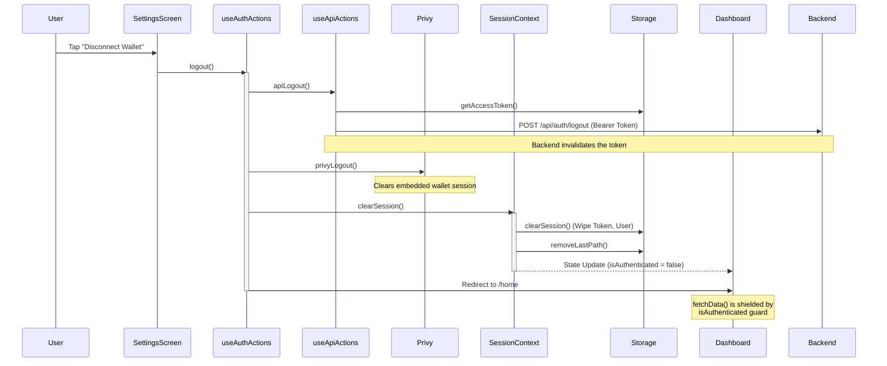

# GeSIM Logout & Disconnect Flow

This document details the sequence of events that occur when a user clicks the **"Disconnect Wallet"** button in the Settings screen.

## Flow Overview

The logout process is designed to be destructive and atomic to ensure no sensitive data (access tokens, user info) remains in memory or local storage after the session ends.

## Detailed Steps

### 1. External API Logout (`apiLogout`)
- **Hook**: `useApiActions.handleLogout`
- **Action**: Sends a request to the backend to invalidate the current `accessToken`.
- **Handling**: This step is designed to fail silently. Even if the backend is down, the app proceeds to clear local data.

### 2. Provider Disconnect (`privyLogout`)
- **Hook**: `@privy-io/expo`
- **Action**: Disconnects the embedded Solana wallet and clears the Privy session.

### 3. Local State Clearance (`clearSession`)
- **Hook**: `SessionContext.logout`
- **Actions**:
    - Calls `storage.clearSession()` which wipes `access_token` and `user_data` from Secure Store.
    - Sets `user` state to `null`.
    - Sets `isAuthenticated` to `false`.
    - Wipes cached path data.

### 4. Navigation Redirection
- **Action**: `router.replace('/home')`
- **Purpose**: Moves the user away from protected screens (Tabs) to the landing/login screen.

## Safety Guards

To prevent errors like "No token found" during this rapid sequence:
1. **Authenticated Guard**: The `DashboardScreen` and other protected components check the `isAuthenticated` flag before attempting any background data fetching.
2. **Axios Interceptor**: If an API call is accidentally triggered after logout, the Axios Request Interceptor (`axiosInstance.ts`) detects the missing token and cancels the request before it hits the network, throwing a `NO_TOKEN` error.
3. **Graceful Rejection**: The Dashboard's `fetchData` routine catches `NO_TOKEN` errors silently to avoid cluttering the user's console with red error boxes during a normal logout.
