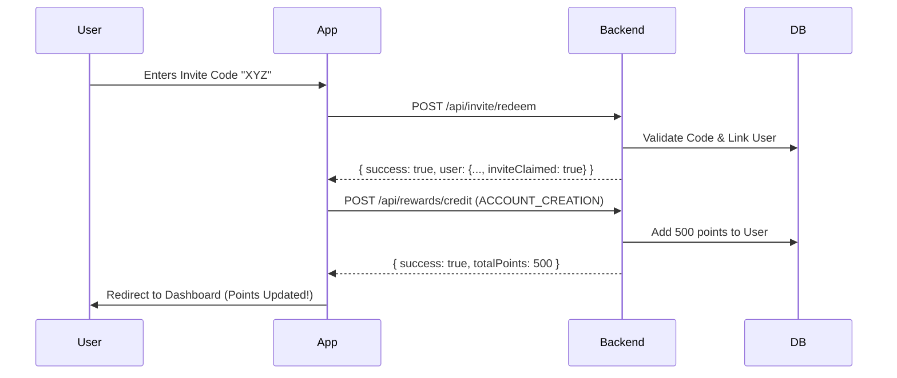

# GeSIM Onboarding Flow

This document details the step-by-step process of a user entering the GeSIM application, from authentication to reaching the Dashboard.

## Flow Comparison

| Stage | New User | Returning User |
| :--- | :--- | :--- |
| **1. Landing** | Arrives at `/home` | Arrives at `/home` (or `/index` redirect) |
| **2. Auth** | Logs in via Privy | Auto-logs in or clicks Login |
| **3. Gatekeeper** | Redirected to `/invite` | Redirected to `/invite` -> `/tabs` |
| **4. Wallet** | Wallet created automatically | Wallet already linked |
| **5. Invitation** | Must enter invite code | Skip (already claimed) |
| **6. Dashboard** | Enters `/ (tabs)` after code | Enters `/ (tabs)` immediately |

---

## Technical Flow Details

### 1. The Gateway (`app/index.tsx`)
This is the main entry point. It acts as a router based on the session state.
- **Wait for Hydration**: Ensures `SessionContext` and `Privy` are ready.
- **Redirection Logic**:
    - If `isAuthenticated` and `inviteClaimed`: Go to `/(tabs)`.
    - If `isAuthenticated` and `!inviteClaimed`: Go to `/invite`.
    - If `isConnected` (Privy) but `!isAuthenticated` (Backend): Go to `/invite` (to sync session).
    - Else: Go to `/home`.

### 2. Login Flow (`app/home.tsx`)
- User triggers `usePrivy().login()`.
- Upon successful Privy authentication, the user is redirected to `/invite` (via `index.tsx` logic).

### 3. Invite & Sync (`app/invite.tsx`)
This screen serves two purposes: **Syncing the session** and **Collecting Invite Codes**.

#### A. Session Sync (Auto-Login)
- If a user is logged into Privy but not the backend, `InviteScreen` calls `handleLogin({ email, walletAddress })`.
- This ensures the backend has a record of the user and returns an `accessToken`.
- If the user has already claimed an invite in the past, they are automatically redirected to `/(tabs)`.

#### B. Wallet Creation
- If the user doesn't have an embedded Solana wallet, `InviteScreen` triggers `wallet.create()` automatically in the background.

#### C. Redeem Invite Code
- User enters a code (e.g., `GSM-12-345`).
- **Verifying**: Calls `redeemInvite(code)`.
- **Backend Action**: `/api/invite/redeem` validates the code and links it to the user.
- **Reward Crediting**: Upon success, the app triggers `handleCreditRewards` with `reason: 'ACCOUNT_CREATION'`. This adds the sign-up bonus to their balance.
- **State Update**: The session user object is updated with `inviteClaimed: true`.
- **Redirect**: The screen detects the state change and moves the user to Dashboard (`/(tabs)`).

### 4. Dashboard (`app/(tabs)/index.tsx`)
- The user finally lands on the main dashboard.
- `fetchData` runs to retrieve their active eSIMs and Rewards balance.

---

## Reward Crediting Logic
Points are credited specifically during the **Redeem Invite** step.

> [!NOTE]
> The `referenceId` for the account creation reward is formatted as `invite_{CODE}_{USER_ID}` to ensure uniqueness and prevent double-crediting.
